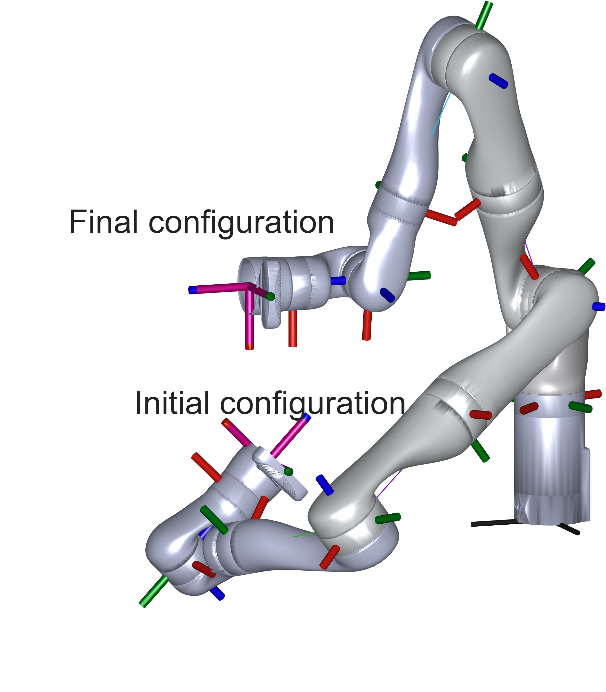

# A model-free approach to control barrier functions for higher-order systems

## Description

This repository contains the MATLAB code that accompanies the paper 
 **A model-free approach to control barrier functions for high order
systems**, 2026, [ArXiv link](https://arxiv.org/...).
**Authors:** Lukas Lanza, Johannes Köhler, Dario Dennstädt, Thomas Berger, Karl Worthmann

## Prerequisites

- [MATLAB](https://de.mathworks.com/products/matlab.html)  
- [Robotics System Toolbox](https://uk.mathworks.com/products/robotics.html)  

## Usage

- `main.m` runs simulations; where you can toggle on the CBF or run a pure funnel controller
- `setup.m` loads the robot dyanmics, designs initial and final configuration and makes corresponding plot
- `makeplots.m` generate the plots and provides quantitative metrics
 

